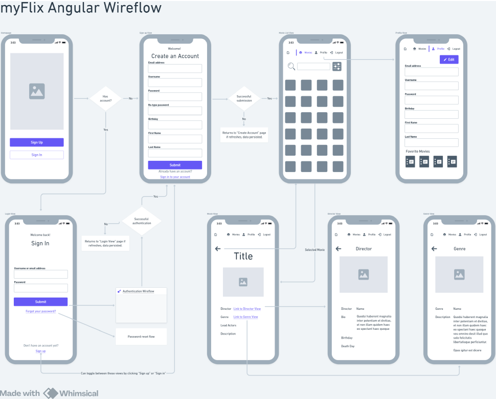

# Welcome to the myFlix Client (Angular)

The client side of the myFlix app using Angular that's using the server-side [movie_api](https://github.com/eahowell/movie_api) (REST API and Database)

This project was generated with [Angular CLI](https://github.com/angular/angular-cli) version 18.2.9.

## Key Features
- Your app should display a welcome view where users will be able to either log in or register an
account.
- Once authenticated, the user should now view all movies.
- Upon clicking on a particular movie, users will be taken to a single movie view, where
additional movie details will be displayed. The single movie view will contain the following
additional features:
  - A button that when clicked takes a user to the director view, where details about the
director of that particular movie will be displayed.
  - A button that when clicked takes a user to the genre view, where details about that
particular genre of the movie will be displayed.

## Technical Requirements
The project technical requirements include:
- The application must be written in Angular (version 9 or later)
- The application requires the latest version of Node.js and npm package
- The application must contain user registration and login forms
- The application must be designed using Angular Material
- The application's codebase must contain comments using Typedoc
- The project must contain technical documentation using JSDoc
- The project must be hosted on GitHub Pages

# User Stories

<table>
<tr>
<td width="50%" valign="top">

## 1. Movie Information Access
Users can access information about movies, directors, and genres.

### Navigation Features
#### Logged-in Users
- Movies Button → Movie List
- User Profile Button → User Profile
- Logout Button with redirect to Login
- Logged-in user indicator
- Brand Logo → Homepage

#### Non-logged Users
- Brand Logo → Homepage
- Login Button → Login View
- Sign-Up Button → Sign-Up View

### Core Views
#### Homepage
- App Title
- Navigation Toolbar
- Login/Sign-Up buttons

#### Movie List (Authenticated)
- Search functionality (Optional Feature)
- Genre/Director filters
- Movie Cards display

#### Movie Card (Authenticated)
- Movie poster
- Title and Director
- Details button → Movie View
- Add to Favorites button

#### Movie Details (Authenticated)
- Movie poster
- Full details (Title, Director, Genre, Cast, Description)
- Navigation to Director/Genre views

#### Director/Genre Details
- Director: Bio, Birth/Death dates
- Genre: Name and Description
- Return navigation
</td>
<td width="50%" valign="top">

## 2. User Profile Management
Users can create a profile to save data about their favorite movies

### Authentication Views
#### Login
- Username/Password fields
- Sign in with API authentication
- Sign-Up redirect
- Password reset
- Form validation

#### Sign-Up
- Required fields:
  - Username
  - Password + confirmation
  - Email
  - Birthday
  - First/Last Name
- Register with API integration
- Form validation

### Profile Features (Authenticated)
- User Information management
- Form validation
- Favorite Movies List with Movie Cards

</td>
</tr>
</table>

## App Wireflow

## Development server

Run `ng serve` for a dev server. Navigate to `http://localhost:4200/`. The application will automatically reload if you change any of the source files.

## Code scaffolding

Run `ng generate component component-name` to generate a new component. You can also use `ng generate directive|pipe|service|class|guard|interface|enum|module`.

## Build

Run `ng build` to build the project. The build artifacts will be stored in the `dist/` directory.

## Running unit tests

Run `ng test` to execute the unit tests via [Karma](https://karma-runner.github.io).

## Running end-to-end tests

Run `ng e2e` to execute the end-to-end tests via a platform of your choice. To use this command, you need to first add a package that implements end-to-end testing capabilities.

## Further help

To get more help on the Angular CLI use `ng help` or go check out the [Angular CLI Overview and Command Reference](https://angular.dev/tools/cli) page.

## API Endpoints

- API is housed on Heroku
- [Find the API and it's endpoint documentation here](https://github.com/eahowell/movie_api/blob/main/README.md)

### Database
- myFlixDB is stored in MongoDB
- Collections include:
  - Users
  - Movies
  - Genres
  - Directors
  - Actors

## License
- API uses ISC
- Angular uses MIT https://angular.dev/license
- RxJS uses Apache-2.0 http://www.apache.org/licenses/
- tslib uses 0BSD
